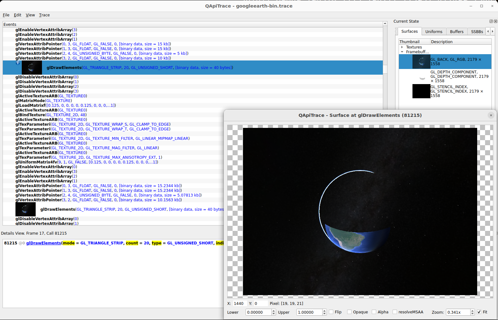

# Tracer Overview

This directory contains a minimal [apitrace](https://apitrace.github.io) fork focused on capture + runtime export.

During execution, the tracer:

1. Keeps writing the standard `.trace` (standard apitrace behavior).
2. Exports per-frame blobs/artifacts to `/media/ramdisk/output/%05d/` (modified/added behavior in this fork).

## Goal of this variant

- Keep compatibility with the normal `apitrace` workflow (`.trace`).
- Extract large binary data during tracing (without relying only on post-processing).
- Export textures when they appear as blobs in relevant GL calls.

## Using apitrace to intercept Google Earth desktop app OpenGL calls

In linux, `google-earth-pro` script is modified to end with `apitrace trace "$(dirname "$(readlink -f "$0")")/googleearth-bin" "$@"`.
When running, a `googleearth-bin.trace` or similar (appending numbers on each new run) will be written at program folder.

After closing the Google Earth session, the main .trace file can be opened with `qapitrace` program, which allows to debug information
captured for each frame. Next figure shows an advance in the back buffer showing partial drawing of a single frame.



Note that this program will also write additional binary data to the folder configured by `OUTPUT_DIRECTORY` variable in the [CMakeLists.txt](CMakeLists.txt)
file.

## Relevant GL hooks for textures

In the current implementation (see `wrappers/glxtrace.py` + `lib/trace/trace_writer.cpp`), texture state for export is prepared in:

- `glTexImage2D`
- `glTexSubImage2D`
- `glCompressedTexImage2DARB`
- `glBindTexture` (updates `THE_TextureId`)

The frame number is updated in `glXSwapBuffers` using `THE_FrameNumber`.

## Texture export format (current)

Export happens from `Writer::writeBlob(...)` when texture context is active (`THE_TextureFormat/THE_TextureWidth/THE_TextureHeight`):

- Compressed DXT1 (`GL_COMPRESSED_RGB_S3TC_DXT1_EXT`): exported as `.dds` with DDS header.
- Uncompressed and decodable (`type == GL_UNSIGNED_BYTE` and supported formats): exported as `.png`.

Filename pattern:

- `/media/ramdisk/output/%05d/%dx%d_%d.dds`
- `/media/ramdisk/output/%05d/%dx%d_%d.png`

Where the final `%d` corresponds to `THE_TextureId`.

Note: currently the code does not export `.ppm`; the implemented uncompressed output is `.png`.

## Other exported blobs

Besides textures, blobs are also exported for geometry/buffer analysis:

- `glDrawElements` (indices)
- `glVertexAttribPointer`
- `glBufferData` / `glBufferSubData` (snapshots and metadata)

A per-frame `manifest.txt` is generated with `key=value` lines describing each export.

## Output layout

- `/media/ramdisk/output/%05d/gl.txt`
- `/media/ramdisk/output/%05d/manifest.txt`
- `/media/ramdisk/output/%05d/*.dds|*.png|*.bin.bz2|*.meta.txt`

## Variables and runtime flags

- `TRACE_FILE`: path to the `.trace`.
- `TRACE_TIMESTAMP`: timestamp in trace filename.
- `FLUSH_EVERY_MS`: periodic flush of the trace stream.
- `TRACE_WRITE_GLTXT=0`: disables writing `gl.txt`.
- `TRACE_PNG_THREADS`: number of async PNG workers (default: autodetect with conservative cap; valid range `1..256`).
- `TRACE_PNG_QUEUE`: max queue size for async PNG export (default `128`, max `4096`).
- `TRACE_BZ2_THREADS`: number of async bzip2 blob-compression workers (default `8`).
- `TRACE_BZ2_QUEUE`: max queue size for async bzip2 blob compression (default `1024`, max `65536`).

## Async PNG export (producer-consumer)

- The tracing thread enqueues PNG jobs and **copies the blob** into job-owned memory.
- A worker pool consumes the queue and writes `.png` files in the background.
- Thread-safe dedupe by `frame + textureId` with `pending/exported` states.
- The queue is bounded: if full, the producer blocks until space is available.

Notes:
- `.dds` (DXT1) export remains synchronous.
- If `TRACE_PNG_THREADS` is not defined, the pool is sized automatically with a conservative limit (up to 12 workers) to avoid excessive contention.

## Async binary blob compression

- Geometry/buffer blobs are still first written as `.bin` by the tracing thread.
- Once each `.bin` is closed, its path is enqueued for background bzip2 compression to `.bin.bz2`.
- Compression uses a bounded producer-consumer queue; successful compression removes the original `.bin`.
- `manifest.txt` points to the final `.bin.bz2` path and includes `compression=bzip2`.
- The compressor writes to a temporary path and renames to `.bin.bz2` only after success.

## RAMDISK recommendation (`tmpfs`)

This program puts very heavy pressure on the I/O subsystem during capture.
Without a fast write path, capture becomes very slow.

If you have enough RAM, it is strongly recommended to use a `tmpfs` RAMDISK for capture and early-stage processing.

Example on Linux:

```bash
mount -t tmpfs -o size=120G,nr_inodes=8M tmpfs /media/ramdisk/
```

A practical workflow is:

- Capture and initial processing on `tmpfs` (`/media/ramdisk/output`).
- After filtering/organizing the final tiles, copy the resulting dataset to a real SSD for long-term storage.

## Implementation references

- `wrappers/glxtrace.py`: set/reset of `THE_*` globals, frame boundary, GLX/GL hooks.
- `lib/trace/trace_writer.cpp`: `writeBlob`, `exportPlain`, `.dds/.png` export, manifests, and auxiliary blobs.
