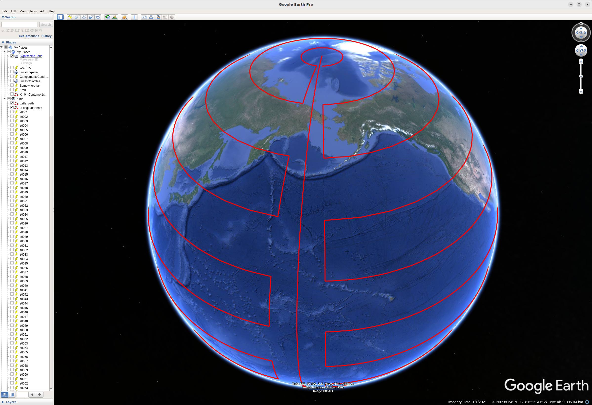

# pathPlanner

`pathPlanner` is a Java 17 + Gradle tool that generates geographic traversal paths for Google Earth capture sessions.

## What it does

- Builds route curves from a start latitude/longitude.
- Supports curve generators:
  - `spiral`
  - `zigzag`
  - `globe`
- Uses geodesic calculations to produce point sequences.
- Writes routes and sampled marker points into the Google Earth KML file at
  `~/.googleearth/myplaces.kml`, inside a folder named `turtle`.
- For `spiral` and `zigzag`, prepends a set of altitude-calibration landmark points
  (`AltitudeGenerator`) before the route markers.
- Always includes a zero-longitude seam reference line (`ZeroLongitudeSeamGenerator`).

The following image shows a `globe` path generated by this program, loaded in to Google Earth. Note that the objective of this path is to have a controlled set of positions where
to place camera navigation, in order to capture required information via `apitrace`.

.

## Purpose in the pipeline

This project provides scan paths used before active tracing, so the controller can follow a planned geographic traversal.

## Run

Example:

```bash
gradle run --args="spiral <lat> <lon> <step_distance_m> <max_distance_m>"
```

Or:

```bash
gradle run --args="zigzag <lat> <lon> <step_distance_m> <max_distance_m>"
```

Or:

```bash
gradle run --args="globe <lat> <lon> <step_distance_m> <max_distance_m>"
```

Helper script:

```bash
./run.sh
```

`./run.sh` is only a convenience launcher. If no arguments are given, it currently runs
the default sample route `globe 0 0 1600000 1`.

## Notes for agentic coding agents

- This is a pure command-line batch tool: no GUI, no interactive input. It runs, writes
  KML, prints a one-line summary and exits.
- All behavior is controlled by the five positional arguments:
  `<generator> <lat> <lon> <step_distance_m> <max_distance_m>` where `<generator>` is
  `spiral`, `zigzag` or `globe`. Invalid arguments cause a non-zero exit.
- Side effect to be aware of: it **modifies** `~/.googleearth/myplaces.kml` in place
  (replacing the `turtle` folder contents), so back it up when experimenting.
