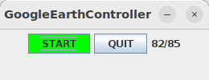

# googleEarthController

`googleEarthController` is a Java desktop controller that automates session progression in Google Earth.

## What it does

- Starts/stops the `12_fileSystemChangesDetector` process.
- Monitors detector output (activity in tracer output folders).
- Keeps a timer-based inactivity cycle.
- When no new writes are detected for a timeout window, sends keyboard actions (`DOWN`, then `ENTER`) to continue navigation.

## How to use

On Google Earth, prepare the path built with `11_pathPlanner` and double click on its first point. Then click in the start
button from the panel and leave the session alone. The controller will run over the points by pressing <Down> and <Enter>
on the keyboard, so no other applications can be used on the session while downloading data in the controlled Google Earth
session.

## Recomended sync with 12_fileSystemChangesDetector

It is recommended to use this panel in sync with `12_fileSystemChangesDetector` for optimal
speed operation in current system. If changes detector is not available, controller will advance to the next position after a fixed amount of time, that can give non-optimal behavior.

## Purpose in the pipeline

The controller simulates user interaction and keeps the session moving at the highest safe speed while avoiding data loss, based on tracer write activity.
