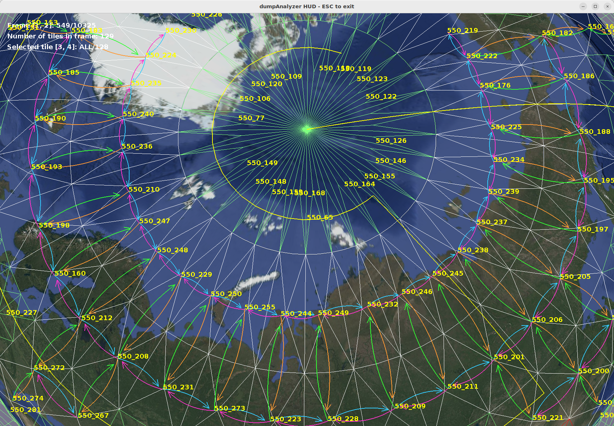

# dumpAnalyzer

`dumpAnalyzer` is a Java 17 + Gradle tool that scans OpenGL trace dumps under the configured
output directory and rebuilds per-frame tile models (geometry, textures, neighborhood
relationships) for the rest of the pipeline.

The input/output directory is read from `output.directory` in
[src/main/resources/application.properties](src/main/resources/application.properties)
(default: `/media/ramdisk/output`).

## What It Does

- Scans the output directory for frame folders named as numbers (for example `00413`).
- For each frame folder containing `gl.txt`, calls frame processing with:
  - `frame`: numeric value from the folder name (for example `413`)
  - `filename`: absolute path to the file (for example `/media/ramdisk/output/00413/gl.txt`)
- Normalizes multiline logical calls (for example long `glShaderSource` payloads split across multiple physical lines).
- Parses content with ANTLR grammar (`GlTrace.g4`) tailored to the current trace format.
- Computes per-frame tile sets, axis-aligned bounding boxes, and tile neighborhood
  relationships (including "uncle" relationships between quadtree levels), exporting the
  result as `frame.json` inside each frame folder.
- Processes globe-level tile sets covering quadtree levels 0-5 and writes a global
  `topLevelTiles.json` file at the root of the output directory (consumed later by
  `32_pyramidalImageExporter`).

## Technical Note: Globe-Level Multipatch Geometry Lifetime

The `skipped` flag on a `TileInstance` means that the tile is not eligible for the
ordinary single-strip frame-tile pipeline. It does **not** mean that its source geometry
is immediately disposable. In particular, globe-level tiles are multipatches: the
current trace contract uses a special tile containing 320 triangle strips to establish
the globe strip identities, and other multipatch appearances are matched against those
identities while building `topLevelTiles.json`.

Code that constructs a skipped tile must therefore preserve `points`, `strips`, and
`stripTexCoords` until `TopLevelTilesJsonBuilder` has finished cataloguing identities and
appearances. Replacing those collections with empty lists merely because the tile is
skipped makes the TOP pass observe zero 320-strip candidates. The resulting file is
syntactically valid but contains an empty `byStripId` object; downstream,
`32_pyramidalImageExporter` then has no absolute quadkey seed and cannot place matrices
even when their relative uncle relationships are intact.

Keeping every multipatch for the entire run has the opposite failure mode: full captures
can retain enough geometry that serializing thousands of `frame.json` files causes severe
GC pressure or an operating-system `SIGKILL` (commonly reported by Gradle as exit code
137). The required lifecycle and phase order are:

1. Parse frames while retaining multipatch source geometry, including skipped tiles.
2. Assign texture paths and compute ordinary neighbor/uncle relationships.
3. Build `topLevelTiles.json` and `globalPatches.json` while the multipatches are still
   available.
4. Release skipped source geometry with `TileInstance.releaseSkippedSourceGeometry()`.
5. Serialize the compact per-frame models to `frame.json`.

Do not move frame serialization ahead of TOP construction, and do not move skipped
geometry release ahead of it. If this lifecycle changes, validate a full capture rather
than relying only on small or single-strip samples. Useful post-run checks are:

```bash
jq '.byStripId | length' /media/ramdisk/output/topLevelTiles.json
jq '[.byStripId[].appearances[]?] | length' /media/ramdisk/output/topLevelTiles.json
```

For the current trace contract, the first command should report 320 rather than zero;
the appearance count must also be non-zero. Treat an empty `byStripId` as a failed TOP
reconstruction even if `22_dumpAnalyzer` itself exited successfully.

In the following image:
- Triangle fans making up the geometry of the 3D scene are shown with white line borders.
- Image pairs frame_id are show in yellow
- Arrows shows detected neighbor relationships in the level with most samples



## Error Behavior

Parsing/lexing failures are treated as fatal:

- The tool prints the absolute path of the failing file.
- The tool exits immediately with `System.exit(666)`.

## Project Layout

- `src/main/java/dumpanalyzer/Main.java`: application entry point and orchestration.
- `src/main/java/dumpanalyzer/io/`: frame scanning (`FrameScanner`), trace parsing helpers
  (`parser/`), traced model import (`TracedModelReader`) and `frame.json` writing (`FrameWriter`).
- `src/main/java/dumpanalyzer/processing/`: neighborhood detection, tile classification,
  uncle relationships (`uncles/`) and globe-level tile sets (`bigtiles/`).
- `src/main/java/dumpanalyzer/model/`: frames, tiles and visualization state.
- `src/main/java/dumpanalyzer/render/`: JOGL renderers and HUD.
- `src/main/java/dumpanalyzer/gui/`: keyboard and mouse interaction.
- `src/main/java/dumpanalyzer/logger/FatalErrorHandler.java`: fatal error reporting and exit.
- `src/main/antlr/GlTrace.g4`: ANTLR grammar for trace lines.

## Requirements

- Java 17
- Gradle
- Vitral artifacts available

## Execution Modes

The program supports two execution modes:

- Interactive mode: runs the JOGL viewer and lets you inspect tiles, AABBs, and neighborhood links visually.
- Offline mode: renders one frame directly to an image file without opening the interactive window.

Helper scripts:

- `./run.sh` runs the interactive mode (`gradle run`).
- `./runOffline.sh` runs offline mode and exports frame `00003` to `output/frame0003.png`.

## Interactive usage guide

Program-specific keys (generic camera handling comes from Vitral and is not listed here):

| Key | Action |
|---|---|
| `1` / `2` | Select previous / next frame |
| `3` / `4` | Select previous / next tile (cycles through `ALL` and individual tiles) |
| `c` | Toggle active camera: traced Google Earth camera vs. free orbiter camera |
| `t` | Toggle textured rendering |
| `T` | Toggle the on-screen texture preview for the selected tile |
| `ESC` | Exit |

The HUD shows the selected frame (`Frame [1, 2]`), tile count, selected tile
(`Selected tile [3, 4]`), and for a single selected tile its geometry summary and texture id.

## Command-Line Options

- `--offline`: render a single frame to an image and exit (no interactive window).
- `--start-frame <id>`: lowest frame id to load (inclusive), and initial selected frame.
- `--end-frame <id>`: highest frame id to load (inclusive).
- `--width <px>`: viewport/output width (default 1280).
- `--height <px>`: viewport/output height (default 720).
- `--output <path>`: output image path used in offline mode.
- `--tile-content-id <id>`: in offline mode, select a tile by content id and enable
  bounding-volume + wireframe display for it.

### Example: load only first 500 frames

If the output directory has 9634 frames and you want faster test cycles:

```bash
gradle run --args="--end-frame 500"
```

## Notes for agentic coding agents

- The full processing pipeline (parsing, neighborhood detection, `frame.json` export,
  `topLevelTiles.json` export) runs in **both** modes before any window opens, so batch
  reprocessing can be driven headlessly with `--offline`.
- Offline mode acts as a remote-controllable renderer: combine `--offline`,
  `--start-frame <id>` (frame to render), `--width`, `--height` and `--output <path>`
  to produce a PNG snapshot of any frame without user interaction, e.g.:

  ```bash
  gradle run --args="--offline --start-frame 3 --output output/frame0003.png"
  ```

- If no graphics system is available, offline image export prints a warning instead of
  failing, but the data-processing side effects still happen.

# Recognized OpenGL API calls

| Category | Functions |
|---|---|
| Shaders / Programs | `glAttachShader`, `glBindAttribLocation`, `glCompileShader`, `glCreateProgram`, `glCreateShader`, `glDeleteProgram`, `glDeleteShader`, `glGetActiveAttrib`, `glGetActiveUniform`, `glGetProgramiv`, `glGetShaderSource`, `glGetShaderiv`, `glGetUniformLocation`, `glLinkProgram`, `glShaderSource`, `glUniform1fv`, `glUniform1i`, `glUniform3fv`, `glUniform4fv`, `glUniformMatrix4fv`, `glUseProgram` |
| Textures | `glActiveTextureARB`, `glBindTexture`, `glClientActiveTextureARB`, `glCompressedTexImage2DARB`, `glDeleteTextures`, `glGenTextures`, `glPixelStorei`, `glTexEnvi`, `glTexImage2D`, `glTexParameterf`, `glTexParameteri`, `glTexSubImage2D` |
| Geometry / Buffers / Draw | `glBindBuffer`, `glBufferData`, `glBufferSubData`, `glDisableVertexAttribArray`, `glDrawArrays`, `glDrawElements`, `glEnableVertexAttribArray`, `glGenBuffers`, `glLineStipple`, `glLineWidth`, `glPointSize`, `glPolygonMode`, `glPolygonOffset`, `glVertexAttribPointer` |
| Transformations / Camera | `glDepthRange`, `glGetFloatv`, `glLoadIdentity`, `glLoadMatrixf`, `glMatrixMode`, `glUniformMatrix4fv`, `glViewport` |
| State / Framebuffer / Tests | `glAlphaFunc`, `glBlendFunc`, `glClear`, `glClearColor`, `glClearDepth`, `glClearStencil`, `glClipPlane`, `glColor4ub`, `glColorMask`, `glColorMaterial`, `glCullFace`, `glDepthFunc`, `glDepthMask`, `glDisable`, `glEnable`, `glFogf`, `glFogfv`, `glFogi`, `glFrontFace`, `glGetIntegerv`, `glScissor`, `glShadeModel`, `glStencilFunc`, `glStencilMask`, `glStencilOp` |
| Lighting / Material | `glLightModelfv`, `glLightModeli`, `glLightf`, `glLightfv`, `glMaterialf`, `glMaterialfv` |
| Context / Window (GLX) | `glXChooseVisual`, `glXCreateContext`, `glXDestroyContext`, `glXMakeCurrent`, `glXSwapBuffers`, `glXSwapIntervalSGI` |

## Expected Blob Contract (Geometry Replay)

For faithful geometry replay (including line primitives), each frame should provide:

- `manifest.txt` entries:
  - `kind=draw_elements ... call=<glDrawElementsCall> ... file=.../drawElements_indices_call_<call>.bin.bz2 mode=<...> type=5123 compression=bzip2`
  - `kind=vertex_attrib ... call=<glVertexAttribPointerCall> ... attribIndex=0 file=.../glVertexAttribPointer_vertexAttrib_call_<call>.bin.bz2 compression=bzip2`
- Binary blobs:
  - index buffer for each exported `glDrawElements` call (`GL_UNSIGNED_SHORT`)
  - position vertex data blob (`attribIndex=0`) compatible with the active index range
  - blobs may be compressed as `.bin.bz2`; `dumpAnalyzer` decompresses them directly in memory and does not expand them to disk

Line support currently expects draw modes:

- `GL_LINES`
- `GL_LINE_STRIP`
- `GL_LINE_LOOP`
