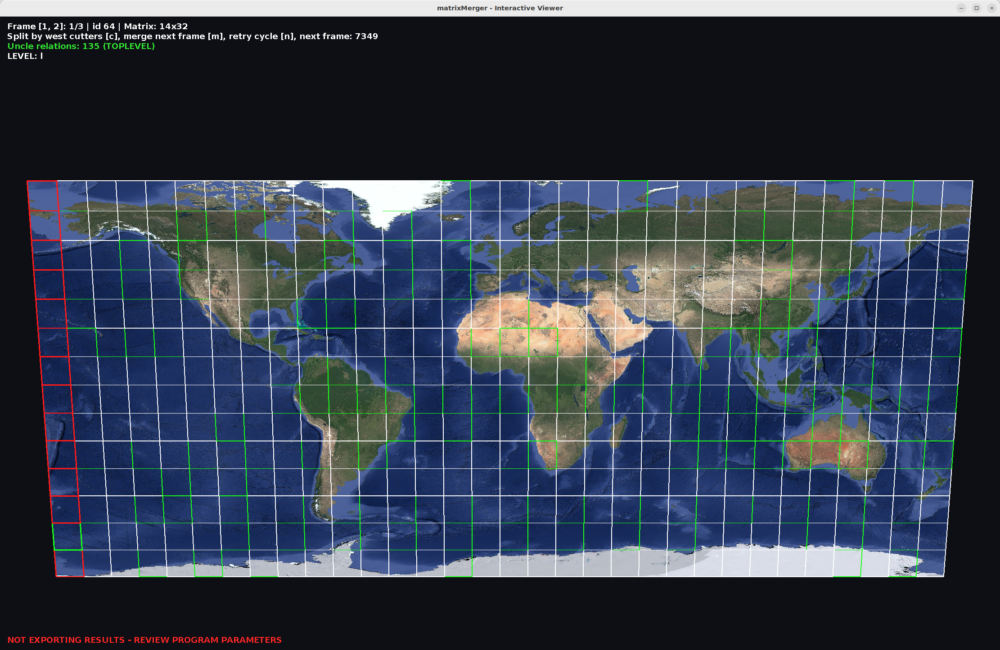

# 31_matrixMerger

`31_matrixMerger` is a viewer/processor for the per-frame tile matrices (`matrix.json`)
generated by `23_frameTextureNormalizer`, focused on merging overlapping matrices into
consolidated layer matrices and exporting them for `32_pyramidalImageExporter`.

## What it does

- Reads matrices from frame folders inside `output.directory` (configured in
  [src/main/resources/application.properties](src/main/resources/application.properties),
  default `/media/ramdisk/output`).
- Reads, propagates and rewrites the west-cutter tile set (`westCutters.json` at the root
  of the data directory), and validates frames against it; invalid frames are flagged in
  the HUD with the reason.
- Displays one active matrix at a time as quads on plane `Z=0`.
- Supports matrix navigation, interactive merges, west-cutter splitting and an automatic
  grouping mode.
- Tracks "uncle" relationships between quadtree levels and reports the hierarchy level of
  each matrix; tiles whose top-level uncles are missing are printed at startup as absolute
  texture paths.
- Exports consolidated results (matrices plus copied tile textures) to a destination
  folder.
- Implements frustum culling to avoid drawing off-camera quads.
- Implements distance-based LOD:
  - Near: full textured quad (pixel-perfect with `NEAREST` + `CLAMP_TO_EDGE`).
  - Far: untextured quad, scaled to `98%` to keep visible separation.
- Manages GPU texture memory with a maximum budget and FIFO eviction.

The following image shows a reconstructed matrix for a global scale tile capture:



Note that in this visualization:
- Tiles are bordered in white
- Tiles with linked uncle tiles are shown in green
- Tiles marked as west-cutters (starting at -180 meridian) are shown in red

## Expected inputs

Each frame must contain `matrix.json` (fallback: `matrix.txt`) with a structure compatible with:

- `frameId`
- `rows`
- `cols`
- `tiles[]` with:
  - `id` (string, recommended)
  - `i`, `j`
  - `textureFile`
  - optional `uncles` metadata

It also accepts legacy numeric `tileId` during deserialization.

## Interactive usage guide

Program-specific keys (generic camera handling comes from Vitral and is not listed here):

| Key | Action |
|---|---|
| `1` / `2` | Select previous / next frame matrix |
| `m` | Merge current matrix with the next one |
| `n` | Retry cycle: keep trying to merge the current matrix with following frames |
| `c` | Split the selected frame by its west-cutter tiles |
| `t` | Toggle textured rendering |
| `ESC` | Exit |

HUD:

- Always: `Frame [1, 2]: i/N | id <frameId> | Matrix: <rows>x<cols>`
- If a next matrix exists: `Split by west cutters [c], merge next frame [m], retry cycle [n], next frame: <id>`
- Uncle relations count, colored green when the matrix reaches top level (`TOPLEVEL`) or
  red when relationships are broken (`BROKEN`).
- `LEVEL: l` / `LEVEL: l + n`: quadtree hierarchy level of the selected matrix.
- On a failed merge (without changing selection): `ERROR: Could not merge with next frame!` (red).
- If the frame failed west-cutter validation: the invalid reason (red).
- If no export folder was given: `NOT EXPORTING RESULTS - REVIEW PROGRAM PARAMETERS` (red).

## Merge algorithms

### `processing.MatrixMerger`

Operates on two matrices `A` and `B`:

1. Finds matching cells by `id` to compute one offset (`MatrixOffset`) for `B` over `A`.
2. If the offset is not consistent for all shared `id` values, it fails.
3. If overlapping cells contain conflicting content, it fails.
4. If valid, adds to `A` the cells from `B` that were not already in `A`.
5. Normalizes `A` coordinates to start at `0` and recalculates `rows/cols`.

### `processing.FullSetMerger`

Iterates through the full list:

1. Takes `A = matrices[i]`, `B = matrices[i+1]`.
2. If merge succeeds, removes `B` and retries with the new next matrix on the same `A`.
3. If merge fails, increments `i`.
4. Stops when only one matrix remains or no more pairs exist.

### `processing.AutomaticGrouper` (`--mode auto`)

Repeats retry-merge sweeps and west-cutter split sweeps over all frames until the frame
count stabilizes. It then follows the uncle relationships between the resulting matrices,
orders them from the top quadtree level to the deepest one, and selects the top level for
the viewer. This is the batch equivalent of pressing `n` and `c` over every frame.

## Execution

### Interactive mode

From repo root:

```bash
./gradlew :31_matrixMerger:run --args="<exportFolder>"
```

The local `./run.sh` runs `gradle run --args="--mode auto"` (automatic grouping, then GUI).
If additional arguments are passed to `./run.sh`, it still prepends `--mode auto` before
them.

### Command-line options

- `<exportFolder>` (positional): destination folder for exported results. If omitted,
  nothing is exported and the HUD shows a red warning.
- `--mode auto`: run the automatic grouper before opening the viewer (default: `manual`).
- `--offline`: without `--level`, run only the global full-set merge and exit. With
  `--level <n>`, render the zero-based matrix level to `/tmp/frame<n>.png` without GUI.
- `--output <path>`, `--width <px>`, `--height <px>`: configure an offline level capture.
- `--all-levels`: with `--offline`, render every final level to
  `/tmp/frame00.png`, `/tmp/frame01.png`, and so on in one grouping run.
- `--diagnose-order`: print the resolved parent matrices, uncle counts and last capture
  frame used by the final hierarchy ordering.

### Results export

When an export folder is given (and after `--mode auto` processing, if requested), each
remaining frame is written as:

- `<exportFolder>/matrix_<n>/matrixLayer.json`
- `<exportFolder>/matrix_<n>/<tileId>.png` (tile textures copied from the source data)

These folders are the input of `32_pyramidalImageExporter`.

Note: the export happens once at startup (after `--mode auto` processing when requested),
before the viewer opens. Merges done interactively afterwards are not re-exported.

## Notes for agentic coding agents

- Batch/automated run without interaction:
  Note: the current implementation checks JOGL/OpenGL availability before any mode
  selection, so even `--offline` still depends on that verification succeeding.

  ```bash
  ./gradlew :31_matrixMerger:run --args="--mode auto /path/to/exportFolder"
  ```

  runs the automatic grouper and exports results; the GUI still opens at the end (close
  with `ESC`). `--offline` is the only non-interactive mode and currently performs just
  the full-set merge without exporting.
- Startup side effects regardless of mode: `westCutters.json` may be rewritten (column
  propagation), and missing top-level uncle tile paths are printed to stdout one per line
  (useful for scripted collection).
- Progress/diagnostics are printed to stdout (`Running automatic retry-merge sweep...`,
  `Export folder ready: ...`), so logs can be parsed to track batch runs.

## Configuration

In `matrixmerger.config.Configuration`:

- `MAX_GPU_TEXTURE_MEMORY`: GPU texture memory limit.
- `MAX_TEXTURED_QUAD_DISTANCE`: distance threshold for using textures.
- `FAR_QUAD_SCALE`: scale of far (untextured) quads.

## Package structure

- `io`: matrix reading/deserialization, west-cutter reading/writing, results export.
- `model`: visualization and selection state, GPU texture budget.
- `processing`: local merge, full-set merge, automatic grouper, west-cutter split and
  validation, uncle relationships (`uncles/`).
- `render`: JOGL renderer, culling, and LOD.
- `gui`: keyboard/mouse handling.
