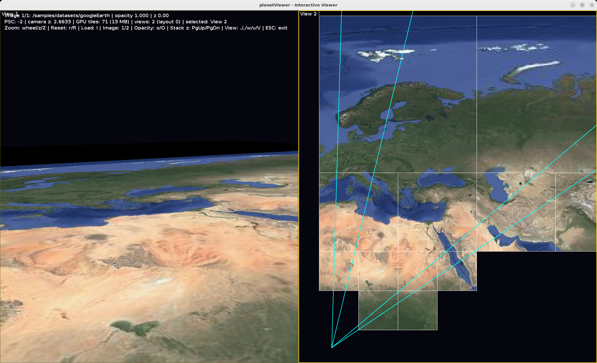

# 41_planetViewer

`41_planetViewer` is an interactive AWT/Swing + JOGL viewer for one or several folder-based
pyramidal images (quadtrees of PNG tiles), such as the ones `32_pyramidalImageExporter`
writes to `/samples/datasets/googleEarth`. It supports arbitrary zoom-in ("infinite zoom")
using Power Scaled Coordinates, stacking several pyramidal images on top of one another, and
up to 4 independent viewports.

## Status

Loads and renders any pyramidal image in the folder-based format, with correct orientation,
frustum culling, projected-area LOD, ancestor-texture fallback for missing/not-yet-loaded
tiles, asynchronous background tile loading, image stacking with opacity/z control, and up
to 4 viewports with several layout styles.

## Inputs

- `<pyramidalImageFolder>` (positional, zero or more): a directory in the folder-based
  pyramidal image format (root `0.png`, then one directory per quadrant digit after the
  root marker; quadrant digit convention 0 = south-west, 1 = south-east, 2 = north-east,
  3 = north-west), e.g. a tile `0303301` lives at `3/0/3/3/0/1/0303301.png`. The reader
  also accepts the previous cumulative-folder layout during migration, e.g.
  `03/030/0303/03033/030330/0303301/0303301.png`. Example root:
  `/samples/datasets/googleEarth` (the default used by `./run.sh`). Each folder given adds
  one image to the stack. With zero folders the viewer opens with an empty scene; use the
  `l` key to load images from a directory chooser at runtime. This folder is read-only input
  for this application.

## Execution

From this directory:

```bash
gradle run --args="/samples/datasets/googleEarth"
```

or `./run.sh`, which forwards its own positional arguments the same way
(`./run.sh [<pyramidalImageFolder> ...]`) and defaults to `/samples/datasets/googleEarth`
when none are given.

## Interactive usage guide

Program-specific keys (generic camera handling comes from Vitral's
`CameraControllerAquynza` and is not listed here, except for the zoom keys, which are
implemented by this application, not the controller):

| Key | Action |
|---|---|
| arrows / mouse drag | Move camera (`CameraControllerAquynza`) |
| mouse wheel, `z` / `Z` | Logarithmic zoom out / in towards the z = 0 plane |
| `r` / `R` | Reset the active camera (top view / oblique view) |
| `l` | Open a directory chooser to load a pyramidal image (adds it to the stack) |
| `1` / `2` | Select previous / next pyramidal image in the stack |
| `o` / `O` | Halve / double the selected image's opacity |
| `PageUp` / `PageDown` | Move the selected image up / down in stacking (z) order |
| `.` | Cycle the selected view |
| `,` | Cycle the layout style for the current view count |
| `w` | Toggle full-viewport for the selected view vs. the multi-view layout |
| `v` / `V` | Add a view (up to 4) / remove the last view (down to 1) |
| `F1`..`F9` | Vitral `RendererConfigurationController` (wires, etc.) |
| `ESC` | Exit |

Clicking (or scrolling) inside a viewport selects that view before the event is processed,
so the camera keys and zoom always act on the view under the cursor.

HUD (bottom-left, drawn over the whole canvas):

- Selected image index/count, its source folder, opacity and z stacking offset.
- Current PSC, the main view's camera z, GPU-resident tile count and memory, and a summary
  of the view count/layout/selection.
- The key bindings line(s).

Each view also draws its own border (thicker and brighter when selected) and title when
more than one view is active.

The following figure shows a two views example of a rendering camera showing the world and a secondary
camera view showing the culling schema implemented in the first camera:



## Arbitrary zoom (Power Scaled Coordinates)

Ported from the old `vsdk_aquynzaScales_stage05_trackerSupport` prototype's
`AquynzaUniverse`: the main view's camera z is kept inside `[1, 10]` every frame
(`planetviewer.processing.PscUpdater`); whenever it would leave that band, the camera
position is rescaled by a power of 10 and an integer `currentPSC` counter is
incremented/decremented instead. Every drawn tile is scaled by
`relativeScale(psc) = 10^(psc - currentPSC - 1)`, so the displayed geometry never needs
coordinates outside a small, precision-safe range no matter how deep the zoom goes. The
`z`/`Z` keys and the mouse wheel drive this zoom logarithmically
(`planetviewer.processing.CameraZoom`), decelerating smoothly as the camera nears the plane.
Past the deepest tile level, tiles keep showing the nearest loaded ancestor's texture
(magnified) instead of going blank.

## Stacking pyramidal images

Each loaded pyramidal image becomes a `PyramidalImageInstance` (translation, PSC level,
opacity, z stacking offset). All instances share the same PSC "universe" and are drawn in
ascending z-offset order with alpha blending, so several images can be layered and made
partially transparent, as the old prototype did (`PageUp`/`PageDown` and `o`/`O`).

## Multi-view

Up to 4 views (`planetviewer.render.View` + `ViewOrganizer`, ported from the old
prototype's `JoglView`/`ViewOrganizer`), each with its own camera and viewport rectangle in
percent coordinates. `ViewOrganizer.doLayout` computes 1..4-viewport layouts with several
styles per view count (cycled with `,`), or a single view full-screen (`w`). One shared
`CameraControllerAquynza` is retargeted to whichever view is selected (by `.` or by clicking
inside a viewport), so keyboard/mouse camera interaction always follows the view under
interaction. PSC renormalization always tracks the first view's camera, so the whole stack
shares one consistent scale regardless of which view is being manipulated.

## Command-line options

- `<pyramidalImageFolder>` (positional, zero or more): see Inputs.
- `--offline`: loads the given pyramidal image folder(s) and renders the whole stack to a
  PNG snapshot without opening a window, using a fixed orthographic top view and
  synchronous (non-async) tile loading, ignoring camera culling/LOD so the whole pyramid is
  visible regardless of framing.
- `--width <px>` / `--height <px>`: offline snapshot size (default `1024x1024`).
- `--output <path>`: offline snapshot path (default `/tmp/planetViewer_offline.png`).
- `--wires`: also draw tile borders in the offline snapshot.

### Offline example

```bash
gradle run --args="--offline /samples/datasets/googleEarth --output /tmp/planet.png"
```

## Notes for agentic coding agents

- `--offline` is a full headless renderer: it runs the whole folder scan and writes a PNG
  snapshot of the stack, so results can be verified without user interaction. On a machine
  without a display, run it under `xvfb-run -a`.
- Startup diagnostics on stdout are parseable: `PlanetViewer: loaded pyramidal image
  <folder>: <n> tiles, height <h>` per loaded image, and `Offline image written to: <path>`.
- An invalid pyramidal image folder (missing `0.png`) prints an `ERROR:` message on stderr
  and is skipped, it does not stop the program; zero valid folders is a valid empty scene.
- `/samples/datasets/googleEarth` is input/read-only for this application.

## Configuration

In `planetviewer.config.Configuration`:

- `MAX_GPU_TEXTURE_MEMORY`: GPU texture memory budget (FIFO eviction beyond this).
- `MAX_RAM_TILE_CACHE_BYTES`: RAM budget for background-decoded tiles awaiting GPU upload.
- `SCREEN_AREA_SUBDIVISION_THRESHOLD`: projected-viewport-area LOD subdivision threshold.
- `defaultDatasetDirectory()`: starting directory for the `l` key's directory chooser.

## Package structure

- `options`: command-line argument parsing.
- `config`: tunables and `application.properties` reading.
- `logger`: minimal prefixed console logging.
- `model`: quadtree nodes, pyramidal images and instances, the image stack, PSC state.
- `io`: folder-structure scanning and background tile PNG decoding.
- `processing`: GL-independent quadtree LOD/cull selection, PSC update, camera zoom math.
- `render`: JOGL renderer, texture cache, views and their layout, HUD.
- `gui`: keyboard/mouse handling, the load-image dialog.
- `animation`: repaint coalescing while background tile loads are pending.
